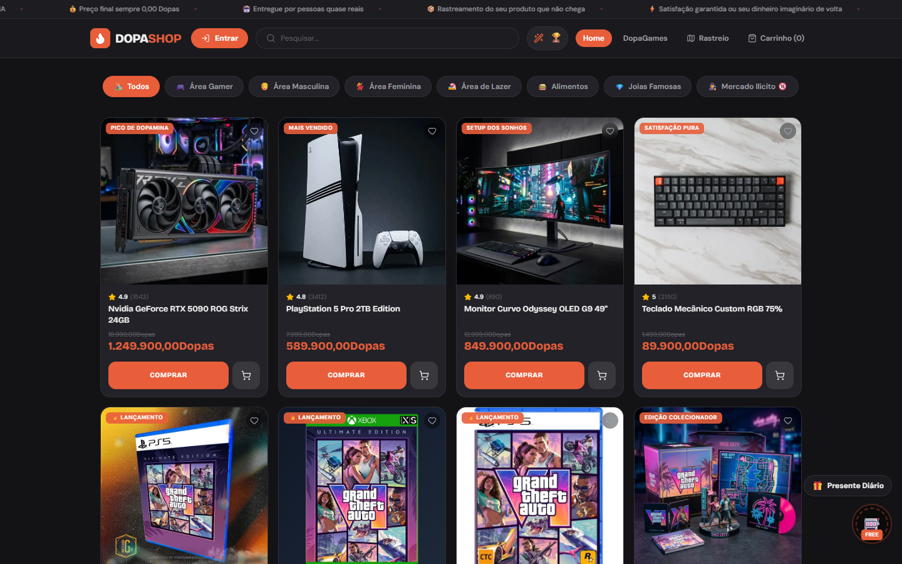
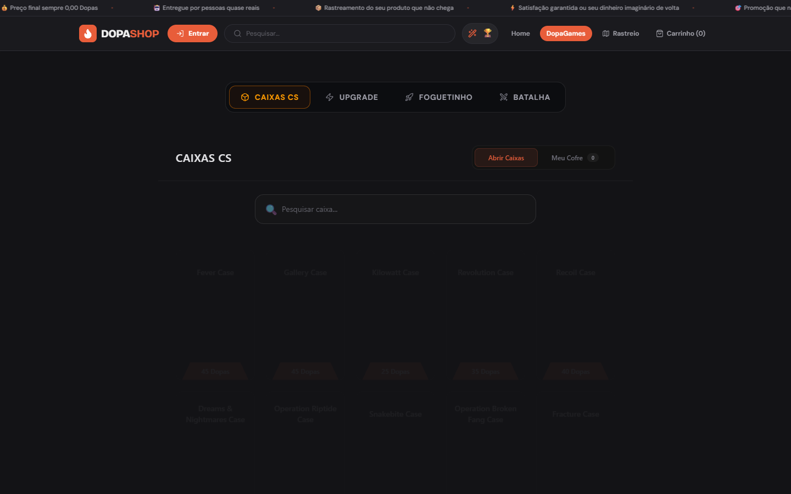

# 💊 Dopamina (DopaShop)

> Um E-commerce gamificado com mecânicas de abertura de caixas (estilo CS2), mini-games e itens hilários!




## 🎮 Sobre o Projeto
O **DopaShop** não é apenas uma loja virtual, é uma experiência interativa. O usuário entra com moedas virtuais (DopaCoins) e pode:
- **Comprar produtos reais/fictícios** (como itens cotidianos até produtos luxuosos).
- **Mercado Ilícito (18+)** e **Mercado de Memes**, com itens bizarros.
- **Abrir Caixas e Roletas** para tentar ganhar upgrades de itens ou prêmios mais raros.
- **Jogar Foguetinho (Crash Game)** e multiplicar suas moedas.
- **Batalhar contra amigos** em duelos de caixas onde o vencedor leva tudo!
- **Inventário:** Guarde seus prêmios ou venda-os de volta por DopaCoins.

## 🚀 Tecnologias Utilizadas
- **Frontend:** React + Vite + Tailwind CSS + Framer Motion
- **Animações e 3D:** Three.js + GSAP + Canvas Confetti
- **Backend:** Node.js + Express + Socket.IO (para batalhas e chats ao vivo)
- **Banco de Dados:** SQLite (na pasta `server/`)
- **Integração Externa:** Supabase

## 🛠️ Como rodar o projeto localmente

Para rodar este projeto na sua máquina, você precisa ter o **Node.js** instalado.

1. **Clone o repositório:**
   ```bash
   git clone https://github.com/markoswcs/Dopamina.git
   cd Dopamina
   ```

2. **Instale as dependências da raiz (Frontend) e do Servidor:**
   ```bash
   npm install
   cd server && npm install
   cd ..
   ```

3. **Inicie o Frontend e o Backend simultaneamente:**
   ```bash
   npm run start:all
   ```
   *O frontend estará disponível em `http://localhost:5173` e o backend rodará em `http://localhost:3001`.*

## ☁️ Rodando diretamente pelo GitHub (Codespaces)

Se você não quer instalar nada no seu computador, pode rodar o DopaShop na nuvem com **1 clique**!

1. No repositório do GitHub, clique no botão verde **Code**.
2. Vá até a aba **Codespaces** e clique em **Create codespace on main**.
3. O GitHub vai carregar um VSCode no seu navegador, instalar tudo automaticamente e iniciar os dois servidores.
4. Quando abrir a notificação de porta, basta clicar em **Open in Browser** na porta `5173`.

---
*Desenvolvido por markoswcs*
